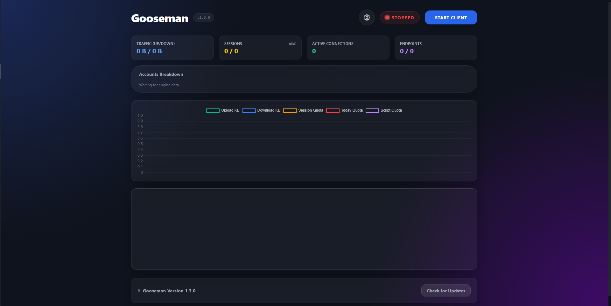

[توضیحات فارسی](./README-fa.md)

# 🦢 Gooseman

Gooseman is a lightweight web dashboard for managing and monitoring a running GooseRelayVPN client on a local machine or LAN server.

It provides a simple control panel for starting and stopping the client, viewing real-time logs, tracking usage statistics, and editing SOCKS proxy configuration through a browser interface.



---

## Features

- A beautiful, modern, and pleasing-to-look-at dashboard.
- **Fully Offline Interface:** All CSS and JS libraries (including Tailwind and Chart.js) are bundled locally. No internet connection is required to load the dashboard's styling or charts.
- Supports both Windows and Linux binaries (The compiled executable release is Windows-only).
- Start and stop the GooseRelayVPN client from a web UI.
- Live log viewer with automatic updates and smart scrolling.
- Real-time session, traffic statistics, and dynamic endpoint monitoring.
- **Auto-Stop Quota Limit:** Capable of automatically stopping the client upon reaching a customizable quota limit to prevent account bans.
- Dashboard password authentication, securely stored independently from the core SOCKS configuration.
- SOCKS5 configuration editor (host, port, optional username/password).
- Responsive design for desktop and mobile devices.
- Lightweight FastAPI backend with no external dependencies beyond Python packages.
- Extremely easy to install and set up.

---

## Architecture

Gooseman consists of two main parts:

- **Backend (FastAPI)**
  - Launches and manages the `goose-client` process.
  - Reads and parses multi-account logs from stdout.
  - Tracks runtime statistics, endpoint health, and quota usage.
  - Exposes a simple HTTP API for the dashboard.

- **Frontend (Single-page HTML)**
  - Built with TailwindCSS and Chart.js (bundled locally).
  - Connects to backend endpoints using the JavaScript fetch API.
  - Displays logs, dynamic stats, and controls in real time.

---

## Requirements (For Source Code Execution)

*Note: If you are using the pre-compiled `.exe` release, you do not need Python or any dependencies.*

- Python 3.9+
- FastAPI
- Uvicorn
- GooseRelayVPN binary (`goose-client` or `goose-client.exe`) placed in the same directory.
- `client_config.json` file in the project root.

---

## Installation & Running

### Method 1: Standalone Executable (Windows)
1. Download the latest `Gooseman.exe` from the **[Releases](../../releases)** page.
2. Place your `goose-client.exe` in the same directory.
3. Double-click `Gooseman.exe`. Your default browser will automatically launch the dashboard.
*(If `client_config.json` is missing, the engine will safely generate a standard default config for you).*

### Method 2: From Source
1. Clone the repository:

```bash
git clone https://github.com/Aydiniyom/Gooseman.git
cd Gooseman
```

2. Install dependencies:

```bash
pip install -r requirements.txt
```

3. Move your `client_config.json` and `goose-client` files inside the project folder.

4. Start the dashboard:

```bash
uvicorn main:app --host 0.0.0.0 --port 5000
```

Then you can access it via the host machine by visiting the URL `http://localhost:5000`.

---

## Updating

Gooseman includes a built-in silent update checker. If a new version is published on GitHub, a notification and download link will seamlessly appear at the bottom of the dashboard.

---

## Thank you...

[@Kianmhz](https://github.com/Kianmhz) for making the wonderful project [GooseRelayVPN](https://github.com/Kianmhz/GooseRelayVPN/tree/main).

Everyone who decided to star the project. It means the world to us.